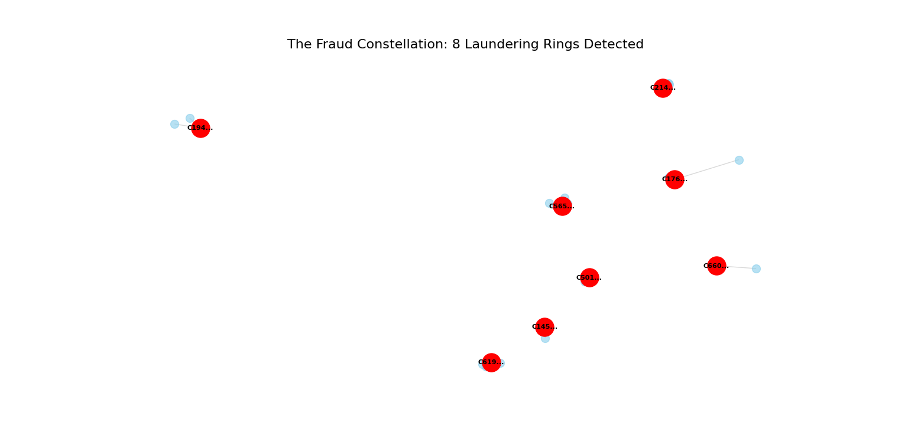
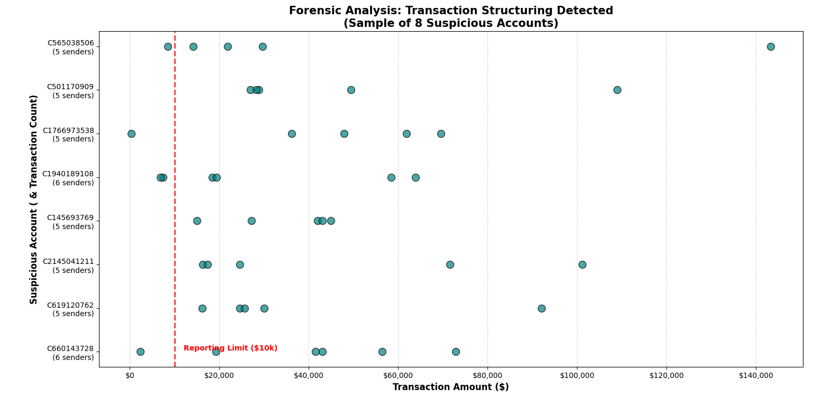
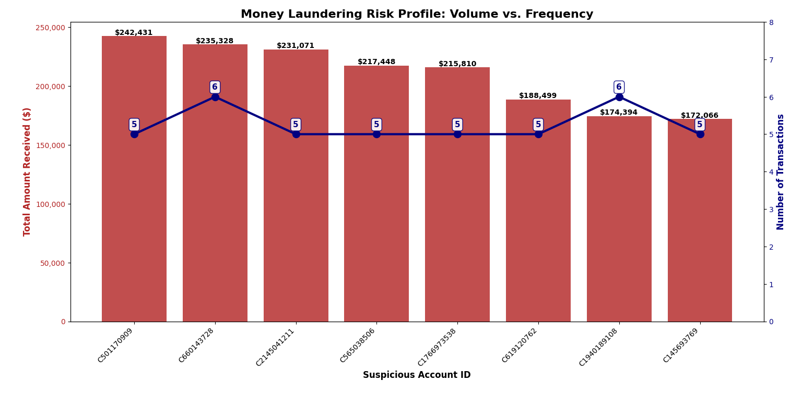

#  Graph-Based Anti-Money Laundering (AML) Engine

###  The Business Problem
Traditional banking compliance relies on static rules (e.g., *"Flag transaction > $10,000"*). Sophisticated criminals evade this by **Structuring** (splitting funds) and **Layering** (moving funds through mule accounts). These patterns are invisible in spreadsheets but obvious in a network graph.

###  The Solution
I built a **Forensic Graph Detection Engine** using Python (`NetworkX`) to identify "Star Topologies" (Many-to-One flows) typical of money laundering rings.

###  Key Results

**1. Network Topology Detection**
*Isolated 8 distinct "Laundering Rings" from 50,000 transactions using In-Degree Centrality.*

**2. Forensic Drill-Down**
*Analyzed transaction distributions to distinguish between legitimate high-value senders and suspicious layering behavior.*

**3. Risk Impact Analysis**
*Quantified the financial exposure. Identified top 8 Kingpins moving over **$1.6 Million** in aggregate illicit volume.*

---

### Tech Stack
 **Python:** Core Logic & Data Processing
 
 **NetworkX:** Graph Algorithms (Centrality, Ego Graphs)
 
 **Pandas:** Data Engineering
 
 **Matplotlib:** Forensic Visualization

 ### Scalability Note
This proof-of-concept processed a **stratified sample of 50,000 transactions** due to local hardware constraints (RAM). The Graph Theory approach ($O(V+E)$ complexity) is computationally expensive for the full dataset of 6.3 million rows.

**Proposed Production Architecture:**
To deploy this on the full 6M+ row dataset, I would migrate from `pandas`/`networkx` to a distributed computing framework:

 **Spark GraphX:** To parallelize the graph construction across a cluster.

 **Neo4j:** To store the transaction network in a native Graph Database for real-time querying.

 **Batch Processing:** Implement a sliding window approach (e.g., scan 1 day of data at a time) rather than loading the entire history into memory.
